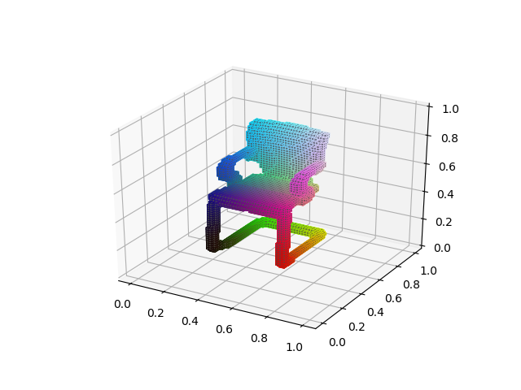
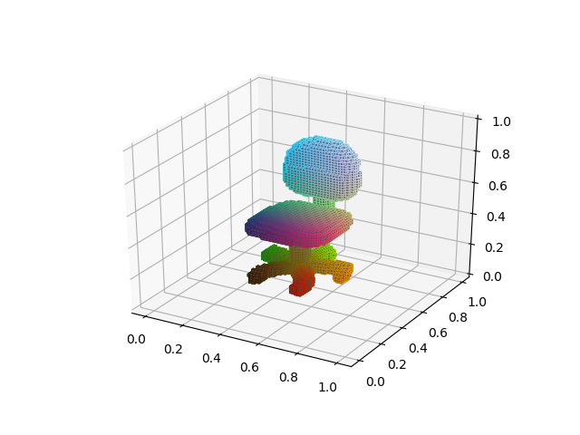
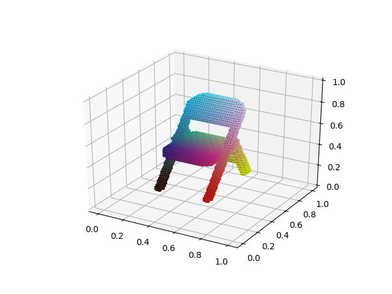
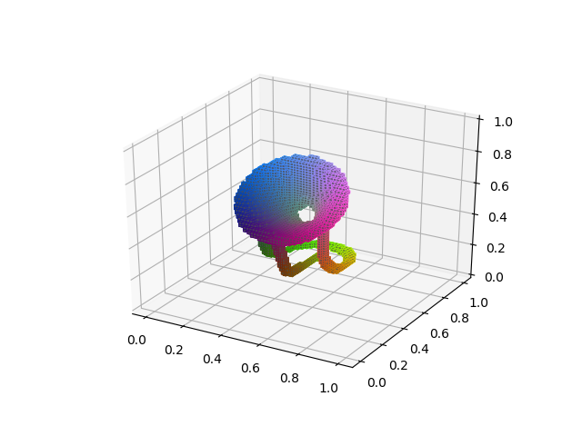

# 3D-printable model generator

## Project Description
This project is trying to use neural network and structural analysis to automatically generate new 3D printable models. 

Currently we will use 3D-GAN which runs on GPU to generate 3D models and use other algorithms running on CPU to make generated model 3D printable.

Some models in dataset.

<table>
<tr>
    <td></td>
    <td></td>
    <td></td>
    <td></td>
</tr>
</table>

Models generate by neural network...Still training ^_^

## Project Source File

* dataIO.py: data input and output model, and can transform mesh model to voxel model
* setting.py: global setting variables
* view.py: tools to visualize model or result
* model.py: design neural network model to generate 3D models. 
* training.py: to train models generator use model designed at model.py. Use PyTorch to train 3D-GAN network to generate voxel models. So useful Reference:
    - 3D-GAN: http://3dgan.csail.mit.edu/
    - 3DGAN Tensorflow implementation: https://github.com/meetshah1995/tf-3dgan
    - 3DGAN PyTorch implementation: https://github.com/rimchang/3DGAN-Pytorch
* utils.py: some auxiliary functions, all other class will inherit this class

## Environment Requirement
1. nvidia drive, cuda 8.0+
2. pytorch 
3. pathos: for multiprocessing, get from "pip install git+https://github.com/uqfoundation/dill.git@master" and "pip install git+https://github.com/uqfoundation/pathos.git@master"
4. trimesh: to read model and transform it, get from "pip install trimesh"

## ChangeLog
20180310 & 20180311 & 20180313
* Fix some training problems. 
* Reorganizd project
* Add main.py as interface to call other modules

20180309
* Finished training procesure. First runable model

20180308
* Finished model construction. 

20180307
* Finished view module. Can use mat files to generate model images

20180306 
* Finished dataIO module, can read and write model, can transform mesh model to voxel model and save them. Can randomly yield models. 

